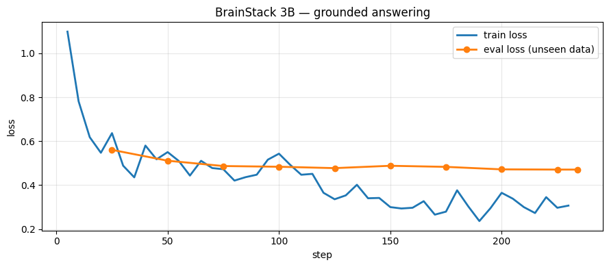

# `training/` — our own fine-tuned LLM

This folder trains a small model to do **one** job from BrainStack's pipeline:
grounded answering. Read the numbered context blocks, answer only from them,
cite with `[n]`, refuse politely when the answer isn't there.

- The plan, in easy English: [`docs/FINETUNE_PLAN.md`](../docs/FINETUNE_PLAN.md)
- Why we're doing it: [`docs/FINETUNE_CONTEXT.md`](../docs/FINETUNE_CONTEXT.md)

```
 Step 1 DATA  ──►  Step 2 TRAIN  ──►  Step 3 EXPORT  ──►  Step 4 INTEGRATE  ──►  Step 5 PROVE
 (this folder)     (Colab T4)         (Ollama)            (backend switch)       (eval harness)
```

---

## What we are NOT doing

We are **not** teaching the model any tenant's documents.

That would break multi-tenant isolation — a model with Acme's handbook in its
weights would leak it to Globex. Documents come from retrieval at question time,
same as today. What gets trained is the **behaviour**: read, cite, refuse.

That distinction is the whole design. Everything below follows from it.

---

## Step 1 · DATA — status: ✅ built

`generate_data.py` builds the dataset by **distillation**: Claude Haiku (the
teacher) writes ideal cited answers over context blocks we assemble, and those
pairs train the 3B student to do the same.

```
  source documents (sources/ + lab/data/handbook.pdf)
        │
        │  chunked by ingestion._splitter()  ← the REAL chunker
        ▼
  passages
        │
        │  2-3 consecutive from one doc  +  2-3 distractors from others
        ▼
  a numbered context block, built by chat.build_user_prompt()
        │
   ┌────┴────┐
   ▼         ▼
 85%        15%
 answerable  refusal trap
   │         │
   │         └─ Claude invents an adjacent-but-absent question;
   │            the answer is the EXACT refusal sentence from
   │            chat.SYSTEM_PROMPT
   └─ Claude invents the question AND writes the ideal cited answer
             │
             ▼
        quality gates  ──►  data/train.jsonl + data/val.jsonl
```

### The rule this script exists to enforce

Training prompts are built by **the same functions the backend uses at question
time**, imported not re-typed:

```python
from app.services.chat import SYSTEM_PROMPT, Source, build_user_prompt
```

Even the refusal sentence is parsed back out of `SYSTEM_PROMPT` at import — if
someone rewords the production prompt, this script raises instead of quietly
teaching the model a sentence the UI no longer recognises.

### Quality gates (a row that fails any gate is dropped, not fixed)

| Gate | Why |
|---|---|
| `evaluation.citation_validity()` | never teach `[7]` when only 6 blocks exist — the same check the eval harness runs |
| answer contains at least one `[n]` | an uncited answer teaches uncited answers |
| citation must not open a sentence | caught in the first smoke run: `[1] Receipts are required` cites nothing yet |
| `not evaluation.is_refusal()` on answerable rows | the teacher sometimes refuses; that row would be mislabelled |
| near-duplicate question check (Jaccard ≥ 0.6) | repeated questions over-weight whatever topic they repeat |
| trap double-check (one extra Haiku call) | if the passages *do* answer it, we'd be teaching a wrong refusal |
| distractor passages in every example | real retrieval returns junk in the top-6; the model must leave it uncited |

### Running it

```bash
# from the repo root, using the backend venv
P=backend/.venv/Scripts/python.exe

$P training/generate_data.py --dry-run          # calls nothing; shows one prompt
$P training/generate_data.py --count 40 --limit 10   # ~$0.01 — READ these rows
$P training/generate_data.py --count 1200       # the real run
$P training/generate_data.py --count 1200       # run again = resumes where it stopped
```

Useful flags: `--workers` (default 4), `--refusal-frac` (0.15), `--val-frac`
(0.08), `--seed` (42), `--no-verify` (skip the trap double-check, cheaper).

**It is resumable.** Rows append to `data/generated.jsonl` as they finish and
recipes are seeded from `--seed`, so a crash at row 900 costs you row 900, not
the first 899. `train.jsonl` / `val.jsonl` are rebuilt from it at the end.

### Cost

~2,500 input + ~250 output tokens per row, at `claude-haiku-4-5` prices:

| Rows | Roughly |
|---|---|
| 800 | $3 |
| 1,200 | $4.50 |

The script prints running cost and an ETA every 25 rows.

### Output

```
data/generated.jsonl   every kept row, append-only, the resume log
data/train.jsonl       ~92% — what Colab trains on
data/val.jsonl         ~8%  — held out, never trained on, catches overfitting
```

Each row:

```json
{"id": 7, "kind": "answerable", "system": "<chat.SYSTEM_PROMPT>",
 "user": "Context:\n[1] (Handbook, p.2) ...\n\nQuestion: ...",
 "assistant": "Claims are due within **45 days** [1].",
 "n_blocks": 5, "docs": ["Handbook", "It Security Policy"]}
```

---

## Step 2 · TRAIN — status: ✅ built

[`finetune_colab.ipynb`](finetune_colab.ipynb) — upload it to
[colab.research.google.com](https://colab.research.google.com), set
**Runtime → T4 GPU**, run the cells top to bottom.

```
 Qwen2.5-3B-Instruct           +  LoRA adapter
 3,000,000,000 numbers            ~30,000,000 numbers  (~1%)
 ❄️  frozen, loaded in 4-bit      🔥 the only thing we train
```

Base model: **`Qwen/Qwen2.5-3B-Instruct`**. Apache 2.0, and — the practical
reason — not gated on HuggingFace, so a dead Colab session costs you a restart
and not a token-paste ritual. Llama 3.2 3B is a one-line swap.

Settings: `r=16`, `lora_alpha=16`, 2 epochs, lr `2e-4`, `max_seq_length=2048`.
Two things in the notebook are worth understanding rather than just running:

- **`train_on_responses_only`** masks the system+user half so the loss only
  counts the *answer*. Without it most of the training effort goes into
  predicting context passages we hand the model anyway.
- **the token-length check** runs before training, not after. Rows longer than
  `max_seq_length` get silently truncated, and you would find out an hour later.
  (Our rows measure ~500–900 tokens, so 2048 is comfortable.)

Watch `eval_loss` on the held-out `val.jsonl`. Falling with `loss` = learning.
Rising while `loss` falls = memorising; drop to 1 epoch.



Our run: 234 steps, 33 min, train 0.64 → 0.31, eval 0.561 → 0.471 — lowest on
the final step, so no overfitting and 2 epochs was right.

**Output:** a ~60 MB LoRA adapter, plus the loss curve above.

---

## Step 3 · EXPORT — status: ✅ built

The last cells of the same notebook merge the adapter into the base weights and
quantize to **GGUF Q4_K_M** (~2 GB) — small enough to run beside the backend in
7.7 GB of RAM.

Then, locally:

```bash
python training/make_modelfile.py     # writes Modelfile from the LIVE prompt
cd training
ollama create brainstack-3b -f Modelfile
ollama run brainstack-3b
```

[`make_modelfile.py`](make_modelfile.py) generates the
[`Modelfile`](Modelfile) rather than shipping a hand-written one — it embeds
`chat.SYSTEM_PROMPT`, and a stale copy would be invisible until the model
started behaving oddly. The backend sends its own system prompt anyway, so this
copy exists to make a bare `ollama run` behave like the app does.

**Expect ~5–15 tokens/sec.** A 150-token answer takes 10–30s. Fine for a demo
and the eval; not fine for production — which is why production stays on Claude.

---

## Step 4 · INTEGRATE — status: ✅ built

```
                    ┌──────────────────────────┐
   question ───────►│  LLM_PROVIDER = ?        │
                    └───────┬──────────┬───────┘
            "anthropic"     │          │  "local"
             (DEFAULT)      ▼          ▼
              ┌──────────────┐  ┌────────────────────┐
              │ LangGraph    │  │ grounded mode      │
              │ agent, tools │  │ retrieve → prompt  │
              │ web, reflect │  │ → Ollama 3B        │
              └──────┬───────┘  └─────────┬──────────┘
                     └────────┬───────────┘
                              ▼
                    identical SSE events
              frontend, /v1/ask and run_eval.py
                     all unchanged
```

| File | Change |
|---|---|
| [`config.py`](../backend/app/config.py) | `LLM_PROVIDER`, `OLLAMA_BASE_URL`, `LLM_MODEL_LOCAL`, `LLM_LOCAL_TIMEOUT` |
| [`services/grounded.py`](../backend/app/services/grounded.py) | new — the local answer path |
| [`services/ask.py`](../backend/app/services/ask.py) | one `if` at the top of `run()` |
| [`tests/test_grounded.py`](../backend/tests/test_grounded.py) | 9 tests, mostly on the event contract |

**The default is `anthropic` and production is untouched** — a test asserts the
default so nobody can ship a Render deploy pointing at a model Render cannot
host. Full suite: **154 passed**.

Why the switch lives in `ask.run()` and not in the routes: both callers (the
app's SSE route and `/v1/ask`) go through it, so one `if` covers both — the
same reason the graph loop was extracted there in Phase 11b.

Why grounded mode skips the agent's tools: tool ROUTING is not the skill we
trained, and a 3B model emits tool-call JSON badly. If it failed we would be
measuring its JSON discipline instead of its grounding. Claude keeps the tools.

To use it, in the repo-root `.env`:

```ini
LLM_PROVIDER=local
```

`ANTHROPIC_API_KEY` must still be set — memory extraction, conversation
summaries and the eval judges all run on Haiku regardless of who writes the
answer.

---

## Step 5 · PROVE — status: ✅ done · [results](../docs/FINETUNE_RESULTS.md)

```
                          claude-haiku-4-5   brainstack-3b
  faithfulness                     1.000          1.000     =
  citation_validity                1.000          1.000     =
  retrieval_hit                    1.000          1.000     =
  refusal on traps                   2/2            2/2     =
  relevance                        0.977          0.909   -0.068
  avg latency                      18.5s          26.0s   +7.5s
  API cost                       metered          $0.00
```

A 4-bit 3B model on a CPU **tied Claude on every metric the fine-tune was
trained to move**, and lost only on relevance. Digging into that gap (written
up in the results doc) showed roughly two thirds of it is judge instability
rather than model quality: `evaluation.relevance()` is one haiku call at
default temperature with no repeats, and re-running it on one unchanged answer
returned both 0.0 and 1.0. The genuine part of the gap is that the small model
is **terser** — it answers the question and stops, where Claude volunteers the
adjacent caveat.

Latency needs an asterisk too: Claude's 18.5s is the *agent* path (tool calls +
reflection critic), ours is a single CPU generation. Different work, not a
like-for-like speed test.


```bash
# 1. baseline — LLM_PROVIDER=anthropic in .env
python eval/run_eval.py --notes "baseline: claude-haiku-4-5"

# 2. ours — LLM_PROVIDER=local, Ollama running
python eval/run_eval.py --notes "brainstack-3b (finetuned)"

# 3. the deliverable
python training/compare_eval.py        # → docs/FINETUNE_RESULTS.md
```

The eval harness needed almost nothing: it drives the real API, so the provider
switch reaches it for free. Two small changes — it now labels the run with the
model that *actually answered* (it hardcoded the agent's model), and records
wall-clock latency per question.

[`compare_eval.py`](compare_eval.py) reads the last two `eval_runs` rows and
writes the comparison, including **refusal-on-traps** computed from
`per_question` — the number a small model is most likely to fail, and one that
averaging into `retrieval_hit` would hide.

### What counts as success

A 4-bit 3B model on a CPU will not beat Claude. It doesn't need to. The result
worth having is:

> citation validity and refusal-on-traps close to Claude's, faithfulness within
> a reasonable gap, at zero API cost.

If it comes out worse, `FINETUNE_RESULTS.md` lists exactly which questions
regressed — and that list is the next round of training data. That loop is the
job.

⚠️ **Caveat on the traps:** `eval/golden.jsonl` has only **2** refusal traps in
22 questions, so that row moves in 50% steps and is closer to an anecdote than a
measurement. Adding ~6 more traps would make it meaningful — but it re-bases the
0.977 faithfulness figure quoted in `docs/PHASE_9_COMPLETE.md`, so both models
would need re-running. Your call.
